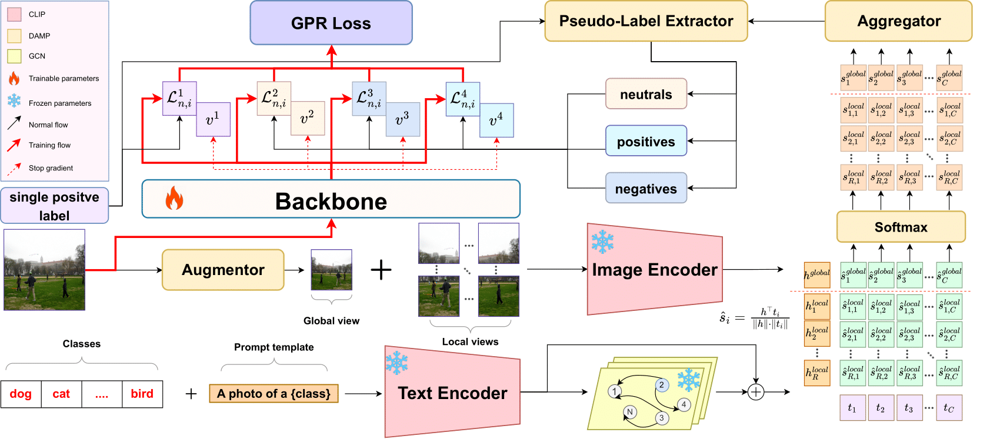
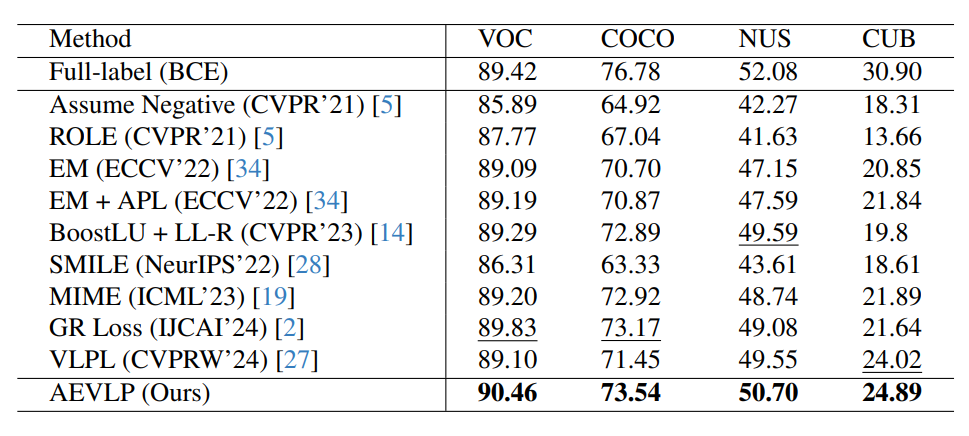

# More Reliable Pseudo-labels, Better Performance: A Generalized Approach to Single Positive Multi-label Learning (ICCV 2025) | [Paper](https://iccv.thecvf.com/virtual/2025/poster/1755)

Primary contact : [luongtk@fpt.com](luongtk@fpt.com)

<p align="center">
</img>
</p>

## Abstract
Multi-label learning is a challenging computer vision task that requires assigning multiple categories to each image. However, fully annotating large-scale datasets is often impractical due to high costs and effort, motivating the study of learning from partially annotated data. In the extreme case of Single Positive Multi-Label Learning (SPML), each image is provided with only one positive label, while all other labels remain unannotated. Traditional SPML methods that treat missing labels as unknown or negative tend to yield inaccuracies and false negatives, and integrating various pseudo-labeling strategies can introduce additional noise. To address these challenges, we propose the Generalized Pseudo-Label Robust Loss (GPR Loss), a novel loss function that effectively learns from diverse pseudo-labels while mitigating noise. Complementing this, we introduce a simple yet effective Dynamic Augmented Multi-focus Pseudo-labeling (DAMP) technique. Together, these contributions form the Adaptive and Efficient Vision-Language Pseudo-Labeling (AEVLP) framework. Extensive experiments on four benchmark datasets demonstrate that our framework significantly advances multi-label classification, achieving state-of-the-art results.

## Setup
To set up the environment and install dependencies, follow these steps:

```bash
# First, clone the repository
git clone https://github.com/Fsoft-AIC/AEVLP.git

# Create a new conda environment
conda create -n spml python=3.9.20

# Activate the environment
conda activate spml

# Navigate to the project directory
cd AEVLP

# Install required packages
pip install -r requirements.txt
```

## Dataset Preparation
Our main experiments use four datasets: COCO, CUB, NUS-WIDE, and PASCAL VOC.

See the instructions in the [Data File](https://github.com/snucml/LargeLossMatters/blob/main/data/README.md) of the [LargeLossMatters](https://github.com/snucml/LargeLossMatters/tree/main) repository for manually downloading and setting up the datasets, or simply download the processed data from our [SPMLData](https://huggingface.co/datasets/moneyzz432/spml-dataset/tree/main) and place them in the `data` folder.  

Once you have finished setting up the data, please configure the dataset paths (or other data-related settings) in the files `config.py` and `datasets.py`.

## Model Training & Evaluation

You can train and evaluate the models by running the following scripts:

```bash
# Train on COCO dataset
bash scripts/train_coco.sh
# Train on CUB dataset
bash scripts/train_cub.sh
# Train on NUS-WIDE dataset
bash scripts/train_nuswide.sh
# Train on PASCAL-VOC dataset
bash scripts/train_pascal.sh
```

The default configuration for each dataset is stored in JSON files located in the `configs/` folder. You can modify these configuration files to adjust various parameters including:

- GPU device selection
- Batch size
- Grid size
- Learning rate
- Other training hyperparameters

Currently, the framework only supports **end-to-end** training configuration.

## Quantitative Results
You can use the pretrained checkpoints for each dataset, available in [SPMLData](https://huggingface.co/datasets/moneyzz432/spml-dataset/tree/main).



## License
Please feel free to copy, distribute, display, perform or remix our work but for non-commercial purposes only.

## Acknowledgements
Our code is heavily built upon [Multi-Label Learning from Single Positive Labels](https://github.com/elijahcole/single-positive-multi-label).